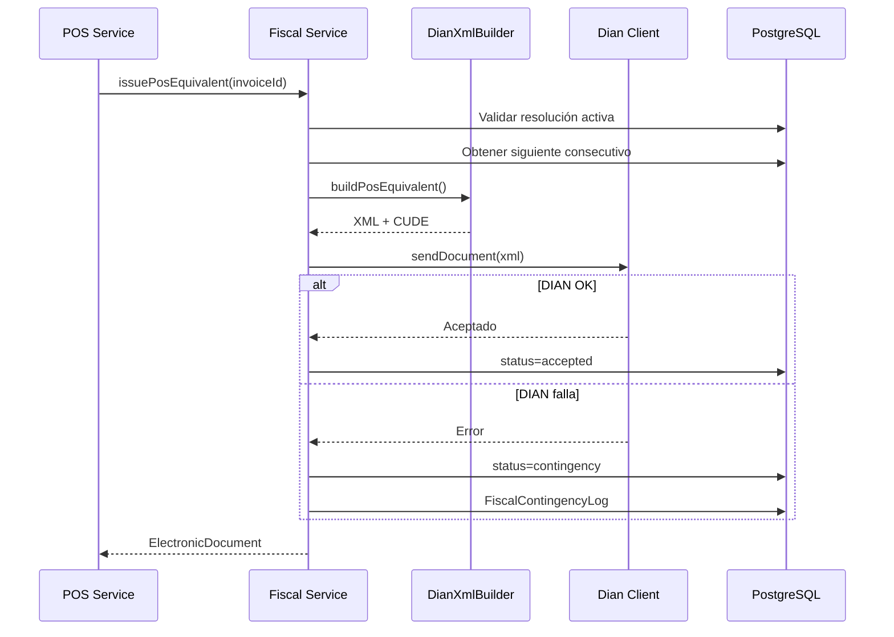

# YallPos — Módulo Fiscal DIAN (Desarrollo Propio)

## Documentos soportados (roadmap)

| Código | Tipo | MVP | Fase 2 |
|--------|------|-----|--------|
| 01 | Factura electrónica | 🔲 | ✅ |
| 20 | Documento Equivalente POS | ✅ | ✅ |
| 91 | Nota crédito | 🔲 | ✅ |
| 92 | Nota débito | 🔲 | ✅ |

## Pipeline de emisión DE POS



## Configuración

Variables en `apps/api/.env`:

```env
# simulacion = desarrollo local (sin llamar DIAN)
# habilitacion = envía al endpoint DIAN de habilitación
# produccion = envía al endpoint DIAN producción
FISCAL_ENV=simulacion
FISCAL_SOFTWARE_ID=YALLPOS-001
FISCAL_SOFTWARE_PIN=pin-habilitacion
FISCAL_CERT_PATH=./certs/certificado.p12
FISCAL_CERT_PASSWORD=password-del-certificado
FISCAL_TEST_SET_ID=id-del-set-de-pruebas-dian
```

## Habilitación DIAN real — pasos

1. Obtener certificado digital .p12 (persona jurídica)
2. Copiar a `apps/api/certs/certificado.p12`
3. Registrar software en portal DIAN → obtener `FISCAL_TEST_SET_ID`
4. Configurar `FISCAL_ENV=habilitacion`
5. Reiniciar API → `GET /v1/fiscal/config` debe mostrar `loaded: true`
6. Enviar set: `POST /v1/fiscal/habilitation/test-set?branchId=UUID`
7. Consultar: `GET /v1/fiscal/habilitation/status/:zipKey`
8. Tras aprobación DIAN → cambiar a `FISCAL_ENV=produccion`

## Resolución DIAN

Modelo `FiscalResolution`:
- `prefix`: ej. EPOS
- `fromNumber` / `toNumber`: rango autorizado
- `currentNumber`: consecutivo actual
- `validFrom` / `validTo`: vigencia
- `technicalKey`: clave técnica DIAN

## Contingencia

Cuando DIAN o internet fallan:
1. Se emite documento con numeración local
2. `status = contingency`
3. Se registra en `FiscalContingencyLog`
4. Job periódico `retryPendingDocuments()` reintenta (máx 5)
5. Tiquete impreso lleva leyenda de contingencia

## CUFE / CUDE

Algoritmo SHA-384 sobre campos obligatorios (Anexo Técnico).
Implementación actual: simplificada para habilitación.
**Producción:** implementar algoritmo completo según Resolución vigente.

## Certificado digital (fase producción)

1. Obtener certificado .p12 de entidad certificadora
2. Almacenar en AWS KMS / Secrets Manager
3. Firmar XML con XAdES-EPES antes de envío
4. Enviar a Web Service DIAN (SendBillSync / SendTestSetAsync)

## Endpoints API

| Método | Ruta | Descripción |
|--------|------|-------------|
| POST | `/v1/fiscal/invoices/:id/emit-pos?branchId=` | Emitir DE POS manual |
| POST | `/v1/fiscal/retry-pending?branchId=` | Reintentar pendientes |
| GET | `/v1/fiscal/documents/:id?branchId=` | Consultar estado |

*Nota: la emisión automática ocurre en `POST /v1/pos/invoices/:id/pay`*

## Checklist habilitación DIAN

- [ ] Registrar software en DIAN
- [ ] Obtener SET de prueba
- [ ] Enviar documentos de prueba
- [ ] Validar XML contra XSD UBL 2.1
- [ ] Implementar firma digital
- [ ] Pasar a producción
